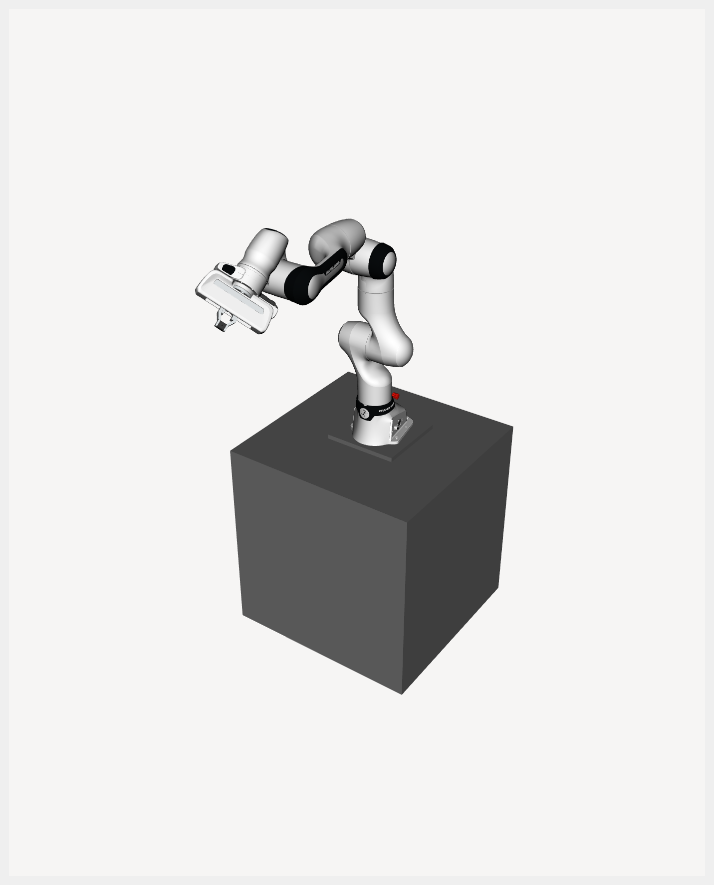
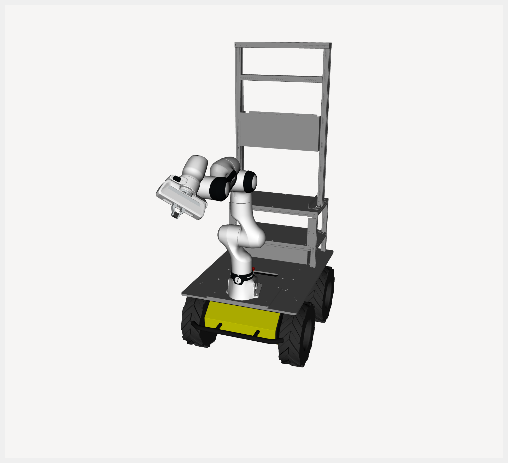
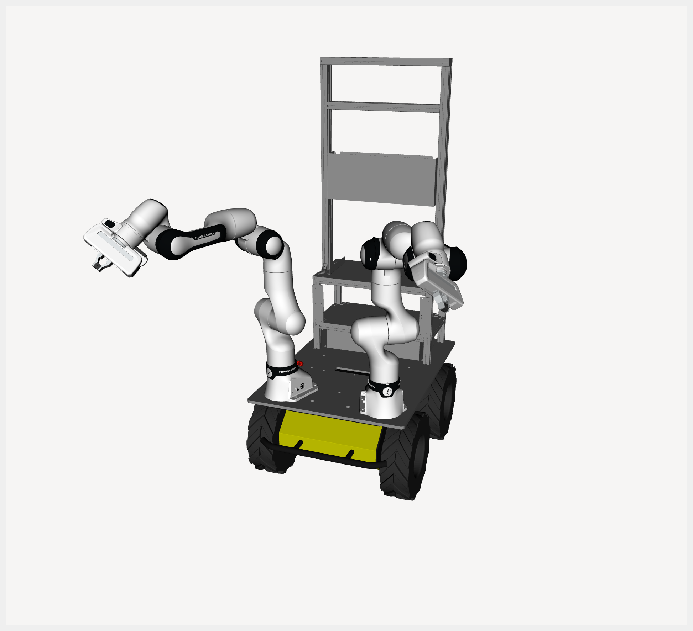

# FR3 Husky ROS 2 Workspace

## Table of Contents
- [Dependencies](#dependencies)
- [Installation](#installation)
- [Package Descriptions](#package-descriptions)
  - [fr3_husky_msgs](#fr3_husky_msgs)
  - [fr3_husky_description](#fr3_husky_description)
  - [fr3_husky_controller](#fr3_husky_controller)
  - [fr3_husky_moveit_config](#fr3_husky_moveit_config)
- [MuJoCo Simulation](#mujoco-simulation)
- [Notes](#notes)

---

## Dependencies

### Required apt Packages
- [ROS2 Humble](https://docs.ros.org/en/humble/index.html)
- [libfranka](https://frankarobotics.github.io/docs/libfranka/docs/installation.html) (Install it without franka_ros2 & franka_description!)

### Required Source Dependencies
- [franka_ros2](https://github.com/JunHeonYoon/franka_ros2) - it includes multi_hardware_interface
- [franka_description](https://github.com/JunHeonYoon/franka_description) - it includes multi_hardware_interface URDF
- [husky](https://github.com/JunHeonYoon/husky) - fix for using with franka (1000Hz)
- [dyros_robot_controller](https://github.com/JunHeonYoon/dyros_robot_controller) - for robot_data
- [mujoco_ros_hardware](https://github.com/JunHeonYoon/mujoco_ros_hardware) - for MuJoCo simulation (optional)

---

## Installation

1. Clone this repository into your ROS 2 workspace:
```bash
cd ~/ros2_ws/src
git clone https://github.com/JunHeonYoon/fr3_husky.git
```

2. Build:
```bash
cd ~/ros2_ws
colcon build --symlink-install --packages-up-to \
  fr3_husky_msgs \
  fr3_husky_description \
  fr3_husky_controller \
  fr3_husky_moveit_config
```

3. Source workspace:
```bash
source ~/ros2_ws/install/setup.bash
```

---

## Package Descriptions

### `fr3_husky_msgs`
- Defines custom action interfaces.
- Example: `GravityCompensation.action`.

### `fr3_husky_description`
- Contains FR3/Husky robot descriptions (`xacro`, mesh, RViz configs).
- Supports single-arm and dual-arm configurations, with or without Husky base.
```bash
# FR3 visualization (optionally with mobile base)
ros2 launch fr3_husky_description visualize_fr3.launch.py \
  robot_side:=left load_gripper:=true load_mobile:=false

# FR3 + Husky visualization
ros2 launch fr3_husky_description visualize_fr3_husky.launch.py \
  robot_side:=left load_gripper:=true
```
- Main launch arguments:
  - `robot_side`: `left`, `right`, `dual`
  - `load_gripper`: `true|false`
  - `load_mobile`: `true|false` (`visualize_fr3.launch.py` only)

| Single FR3                     | Dual FR3                      |
| ------------------------------ | ----------------------------- |
|   |     |

| Single FR3 Husky               | Dual FR3 Husky                |
| ------------------------------ | ----------------------------- |
|   |     |


### `fr3_husky_controller`
- Provides launch files and controller plugin infrastructure for running user-defined controllers on FR3, Husky, and FR3+Husky setups.
- Built-in plugins (temporary examples for verification):
  - `fr3_husky_controller/TestFR3Controller`
  - `fr3_husky_controller/TestHuskyController`
  - `fr3_husky_controller/TestFR3HuskyController`
  - `fr3_husky_controller/FR3ActionController`
  - `fr3_husky_controller/FR3HuskyActionController`
- **User-defined controllers** are added via the code-generation scripts (see below) and run by passing `controller_name:=<your_controller>` to the launch file.

- Launch files (add `use_mujoco:=true` for simulation — see [MuJoCo Simulation](#mujoco-simulation)):
```bash
# FR3 controller — specify your controller with controller_name
ros2 launch fr3_husky_controller fr3_controller.launch.py \
  robot_side:=left load_gripper:=true load_mobile:=false use_fake_hardware:=true \
  controller_name:=<your_fr3_controller>

# FR3 action controller
ros2 launch fr3_husky_controller fr3_action_controller.launch.py \
  robot_side:=left load_gripper:=true load_mobile:=false use_fake_hardware:=true

# FR3 + Husky controller — specify your wholebody controller with controller_name
ros2 launch fr3_husky_controller fr3_husky_controller.launch.py \
  robot_side:=left load_gripper:=true use_fake_hardware:=true \
  controller_name:=<your_fr3_husky_controller>

# FR3 + Husky action controller (includes joy_node)
ros2 launch fr3_husky_controller fr3_husky_action_controller.launch.py \
  robot_side:=left load_gripper:=true use_fake_hardware:=true joy_dev:=/dev/input/js0
```

- Main launch arguments:
  - `robot_side`: `left`, `right`, `dual`
  - `namespace`: ROS namespace
  - `controller_name`: controller to spawn(e.g. `test_fr3_controller`); use this to run your generated controller
  - `load_gripper`: `true|false`
  - `load_mobile`: use Husky as dummy base (not control the Husky) `true|false` (FR3-only launch files)
  - `use_fake_hardware`: `true|false`
  - `fake_sensor_commands`: `true|false`
  - `use_mujoco`: `true|false`
  - `joy_dev`, `joy_deadzone`, `joy_autorepeat_rate` (`fr3_husky_action_controller.launch.py` only)

- Action usage examples (after action controller is running):
```bash
# Discover action endpoints
ros2 action list | grep gravity

# FR3 action controller example
ros2 action send_goal \
  /fr3_action_controller/fr3_gravity_compensation \
  fr3_husky_msgs/action/GravityCompensation \
  "{use_qp: true}" \
  --feedback

# FR3+Husky action controller example
ros2 action send_goal \
  /fr3_husky_action_controller/fr3_husky_gravity_compensation \
  fr3_husky_msgs/action/GravityCompensation \
  "{use_qp: true}" \
  --feedback
```

- Controller code generation — see [GENERATE_CONTROLLER.md](fr3_husky_controller/GENERATE_CONTROLLER.md):
```bash
# FR3-only controller (patches config/fr3_ros_controllers.yaml)
python3 fr3_husky_controller/generate_fr3_controller.py MyNewController --control_mode effort

# FR3+Husky wholebody controller (patches config/fr3_husky_ros_controllers.yaml)
python3 fr3_husky_controller/generate_fr3_husky_controller.py MyWholebody --control_mode effort
```

- Action server code generation — see [ACTION_SERVER_CODEGEN.md](fr3_husky_controller/ACTION_SERVER_CODEGEN.md):
```bash
python3 fr3_husky_controller/generate_fr3_action_server.py GravityCompensation
python3 fr3_husky_controller/generate_fr3_husky_action_server.py GravityCompensation
```


### `fr3_husky_moveit_config`
- Provides MoveIt 2 launch/config for FR3 single/dual setups.
- Includes controller mappings, OMPL planning config, and RViz profile.

```bash
# Recommended MoveIt launch for single/dual setup
ros2 launch fr3_husky_moveit_config fr3_moveit.launch.py \
  robot_side:=left load_gripper:=true load_mobile:=false use_fake_hardware:=true
```
- Main launch arguments (`fr3_moveit.launch.py`):
  - `robot_side`: `left`, `right`, `dual`
  - `namespace`
  - `load_gripper` : `true|false`
  - `load_mobile` : `true|false`
  - `use_fake_hardware` : `true|false`
  - `fake_sensor_commands` : `true|false`

---

## MuJoCo Simulation

All controller launch files support `use_mujoco:=true` to run in MuJoCo instead of real or fake hardware. See [MUJOCO.md](MUJOCO.md) for supported combinations, scene files, and launch argument details.

```bash
# FR3 in MuJoCo (quick start)
ros2 launch fr3_husky_controller fr3_controller.launch.py \
  robot_side:=left load_gripper:=true load_mobile:=false use_mujoco:=true

# FR3 + Husky in MuJoCo
ros2 launch fr3_husky_controller fr3_husky_controller.launch.py \
  robot_side:=left load_gripper:=true use_mujoco:=true
```

---

## Notes
- Default FR3 IPs in launch files are hardcoded:
  - left arm: `172.16.5.5`
  - right arm: `172.16.6.6`
- For real hardware, verify network setup and safety conditions before launching controllers.

## TODO
- In mujoco environment, we use pinocchio to get robot states (e.g. jacobian, mass matrix...). Are these parameters validate data?
- For real robot, franka hand can be controlled by ROS2 action [example](https://github.com/JunHeonYoon/franka_ros2/blob/humble/franka_example_controllers/src/gripper_example_controller.cpp). How to mimic that framework to mujoco environment?
